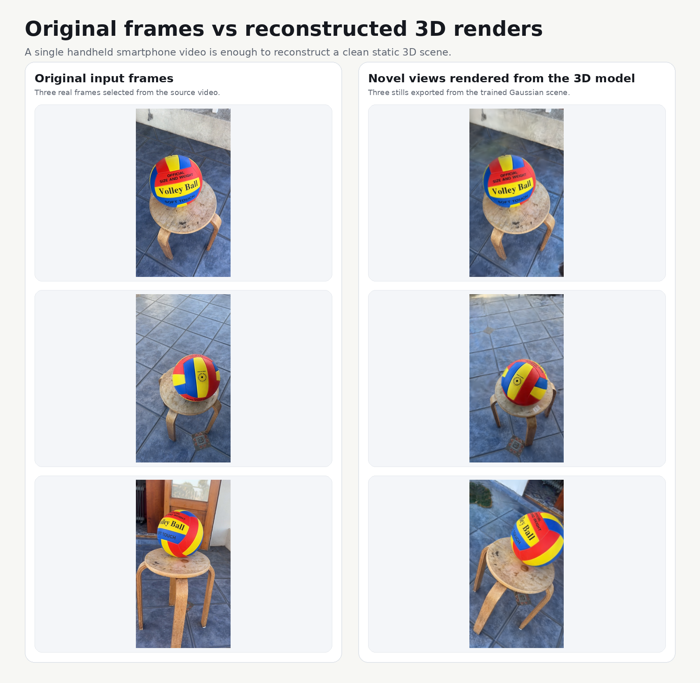

This project takes a single smartphone video and turns it into a static 3D Gaussian scene that you can render from new viewpoints.

I built it as a focused computer-vision portfolio project. The goal is to make the full path from raw video to a convincing result understandable, reproducible, and clean enough that another person can read the code without feeling lost.

## What the project actually does

The pipeline is:

```text
smartphone video
  -> frame extraction
  -> frame selection
  -> camera pose estimation with COLMAP
  -> Gaussian Splatting training
  -> still renders
  -> demo video
  -> browser viewer (easy)
```

The current scope is intentionally small:

- one mostly static scene
- one handheld phone video
- stable lighting
- offline reconstruction

## Example result

The image below shows one real run from this repository: a handheld phone video of a volleyball on a stool, compared against the novel views rendered from the reconstructed Gaussian scene.



The full run also exports:

- a short demo clip at `outputs/.../renders/demo.mp4`
- an interactive browser viewer at `outputs/.../browser_gaussian_viewer/index.html`

That combination is what I wanted from the project: a clear path from real video input to a scene that can be inspected from viewpoints that were never recorded directly.

## Why the pipeline is structured this way

Instead of building a custom SfM stack, I use `COLMAP` for camera reconstruction because it is reliable and well understood.

For Gaussian Splatting, I call a pinned upstream baseline from GraphDeco and keep this repository as a thin orchestration layer around it.

That leaves this repo responsible for the parts that are useful in a portfolio:

- preparing the input video
- making the run reproducible
- choosing conservative defaults
- organizing outputs
- exporting a demo and an interactive viewer

## Repository layout

The project is kept small on purpose.

- `configs/`
  Holds the YAML presets.
- `scripts/`
  Thin CLI entrypoints. Each script does one thing.
- `src/img2gaussian/`
  The actual pipeline code.
- `third_party/gaussian-splatting/`
  The pinned upstream baseline.
- `data/input/`
  Input videos.
- `outputs/`
  Run artifacts like frames, COLMAP outputs, models, renders, and the browser viewer.

## Environment

The only supported environment manager in this repo is `micromamba`. 

Create the environment:

```bash
micromamba env create -f environment.yml -n face-gaussian
micromamba activate face-gaussian
```

The environment file installs the stable system-side tools this project needs, including:

- Python 3.10
- `ffmpeg`
- `colmap`
- CUDA 11.8 toolchain pieces
- `cmake`, `ninja`, `git`

PyTorch is installed separately because the right wheel depends on the local CUDA setup. The default path for this project is `cu118`:

```bash
pip install torch torchvision --index-url https://download.pytorch.org/whl/cu118
```

## Setup after the environment exists

There are two setup scripts.

### 1. Bootstrap the upstream Gaussian Splatting repo

```bash
python scripts/bootstrap.py
```

This script:

- checks that `git`, `ffmpeg`, and `colmap` are available
- clones the upstream Gaussian Splatting repository into `third_party/gaussian-splatting`
- checks out a pinned commit
- initializes the upstream submodules

### 2. Install the Python modules used by the upstream trainer

```bash
python scripts/install_gaussian_deps.py
```

This script:

- installs PyTorch if it is still missing
- installs `plyfile` and `joblib`
- builds and installs the CUDA extensions used by the upstream Gaussian Splatting code
- verifies that `torch.cuda.is_available()` is true

If this script finishes cleanly, the training side of the project is ready.

## Configuration

The project is controlled through a single YAML file per preset.

Main presets:

- [`configs/default.yaml`](configs/default.yaml)
- [`configs/high_quality.yaml`](configs/high_quality.yaml)

Important fields:

- `input_video`
  Path to the source video.
- `workspace_dir`
  Where the run writes all outputs.
- `fps`
  Frame extraction rate.
- `max_frames`
  Maximum number of selected frames.
- `max_long_side`
  Resize target for the longer image side.
- `train_iterations`
  Number of Gaussian Splatting optimization steps.
- `render_mode`
  How the stills are exported.
- `gaussian_repo_dir`
  Location of the upstream GraphDeco checkout.

The default preset is meant to be safer on smaller GPUs. (I run it on a 1060 6GB) 

The high-quality preset pushes the result further, but is slower and more memory-sensitive.

## How to record a usable video

This matters more than most of the code.

The best input for this pipeline is a short, steady capture that gives structure-from-motion enough stable visual information to work with.

Good capture rules:

- record for about `10-30` seconds
- keep the scene mostly still
- move the camera slowly and evenly
- avoid motion blur
- keep lighting stable
- leave some background texture visible

Bad capture patterns:

- fast handheld motion
- strong lighting changes
- heavy blur
- heavy occlusions
- large non-rigid motion in the scene

## Running the pipeline

### Full run

```bash
python scripts/run_pipeline.py --config configs/default.yaml
```

That runs the whole path from video to rendered outputs.

### Step-by-step run

If you want to inspect intermediate results, run the stages separately:

```bash
python scripts/extract_frames.py --config configs/default.yaml
python scripts/select_frames.py --config configs/default.yaml
python scripts/run_colmap.py --config configs/default.yaml
python scripts/train_and_render.py --config configs/default.yaml
```

This is usually the better way to debug a new video because you can stop after each stage and check whether the inputs still look healthy.

## What each stage is responsible for

### `extract_frames.py`

Reads the configured video with `ffmpeg` and writes raw frames into `frames_raw/`.

### `select_frames.py`

Scores sharpness, keeps an evenly spaced subset, resizes the images, and writes the selected training images into `frames_selected/`.

### `run_colmap.py`

Runs the COLMAP stages needed to estimate camera poses and to prepare the dataset layout expected by the Gaussian Splatting baseline.

### `train_and_render.py`

Calls the upstream trainer, then exports stills and a demo clip from the trained scene.

## Interactive viewer

The interactive path in this repo is the browser Gaussian viewer.

Build the viewer from the latest trained model:

```bash
python scripts/build_browser_viewer.py --config configs/high_quality.yaml
```

Build and serve it locally:

```bash
python scripts/run_browser_viewer.py --config configs/high_quality.yaml --port 8765
```

Then open:

```text
http://127.0.0.1:8765
```

This viewer path is intentionally browser-based because it works well over SSH port forwarding. For this project, that is much more practical than depending on a local desktop OpenGL viewer.

If the npm package used for viewer export is missing, the build step installs it automatically from `browser_viewer/package.json`.

## Outputs

Every run writes into the configured `workspace_dir`.

Inside that directory you will find:

- `frames_raw/`
  Raw extracted frames from the input video.
- `frames_selected/`
  The subset actually used downstream.
- `colmap/`
  Intermediate COLMAP work files.
- `dataset/`
  The prepared dataset layout passed to the Gaussian trainer.
- `model/`
  The trained Gaussian model and related metadata.
- `renders/stills/`
  Exported still images.
- `renders/demo.mp4`
  Short demo clip.
- `browser_gaussian_viewer/index.html`
  Self-contained browser viewer export.

## Design choice

This repository contains the orchestration layer and the project-specific logic. `COLMAP` handles camera reconstruction, and the GraphDeco Gaussian Splatting code handles optimization and rendering. That split keeps the repo small and makes the flow from video to result much easier to follow.

## Limitations

This project works well as a portfolio reconstruction pipeline, but it has clear limits.

- It depends heavily on capture quality.
- It is still a static-scene pipeline.
- New viewpoints work best near the observed camera arc.

## Troubleshooting

### `colmap` is missing or unstable

Use a system `colmap` binary and keep the same Python code path.

### CUDA extensions fail to build

Make sure the `micromamba` environment is active and rerun:

```bash
python scripts/install_gaussian_deps.py
```

### `torch.cuda.is_available()` is false

Reinstall the PyTorch wheel inside the active environment:

```bash
pip install torch torchvision --index-url https://download.pytorch.org/whl/cu118
```

### GPU runs out of memory

Lower these values in the config:

- `max_long_side`
- `train_iterations`

If needed, prefer the default preset before trying the high-quality preset.

## Current direction

Right now the repository is about one thing: getting from a real handheld video to a convincing static 3D Gaussian result with code that is straightforward to read. The next big deal will be to connect splats of different captures. (data association) 
